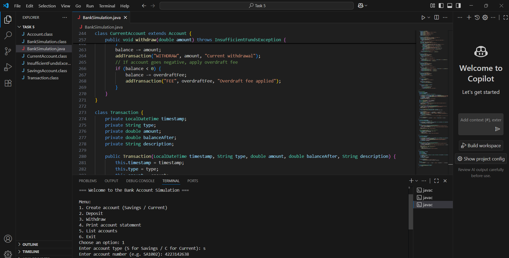

# 📓 Java Notes Master

## 📖 Overview
**Java Notes Master** is a beginner-friendly **Java command-line program** that lets you create, view, and delete personal notes right from your terminal.  
It’s perfect for practicing **Java fundamentals** and **OOP concepts** like classes, objects, and methods in a real project.

With this app, you can keep track of your thoughts, ideas, or tasks without leaving the command line.

---

## 🔹 Features
- ✏️ **Add Notes** – Create and store new notes.
- 📜 **View Notes** – See all your saved notes in an easy-to-read list.
- ❌ **Delete Notes** – Remove notes by their number.
- 🖥 **Menu Driven** – Simple options for quick navigation.
- ✅ **Error Handling** – Prevents invalid actions.

---

## 🛠 Tech Stack
- **Java** – Core language
- **OOP Principles** – Classes, Objects, Encapsulation
- **Scanner Class** – For reading input
- **Any Java IDE** – VS Code, IntelliJ, or Eclipse
- **Command Line** – To run the program

---

## 📸 Sample Output
  
*(Replace `img.png` with your program’s actual screenshot)*

---

## 📂 Repository
🔗 [View on GitHub](https://github.com/Harisivanarayana/JavaNotesMaster/tree/main)

---

## 👨‍💻 Author
**Harishivanarayana**

---

## 🚀 How to Run
1. **Clone the repository**
   ```bash
   git clone https://github.com/Harisivanarayana/JavaNotesMaster.git

